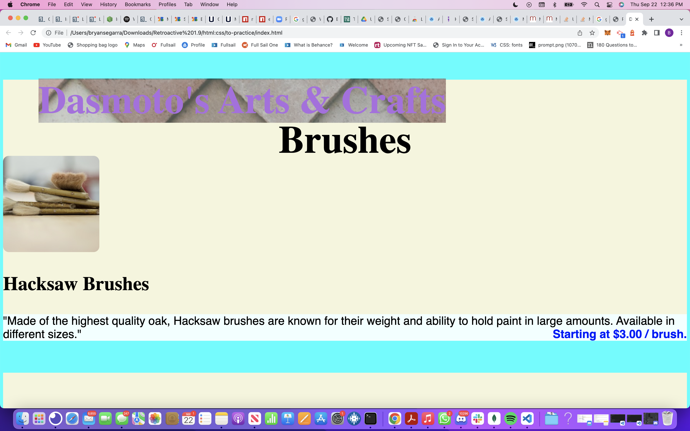
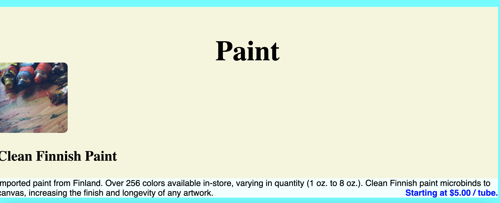
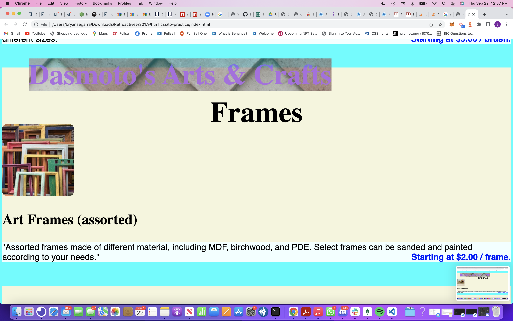

# to-practice

  ## Table-of-Contents
  * [Description](#description)
  * [Installation](#installation)
  * [Usage](#usage)
  
    *[License](#license)
    
  * [Contributing](#contributing)
  * [Tests](#tests)
  * [Questions](#questions)
  
  ## Description
  So this is my first attempt messing around with the styling of this website and it's a good start for me but i'm gonna keep working on to make it even better than before.

  ## [Installation](#table-of-contents)
  none

  ## [Usage](#table-of-contents)
   here are some examples: 

   

   

   
    
  ## Contributing

   
      Thank you for your interest in helping out; however, I will not be accepting contributions from third parties.
      
  ## [Tests](#table-of-contents)
  at moment none 

  ##  [Questions](#table-of-contents)
  Please contact me using the following links:
  [GitHub](https://github.com/Bryguy20)
  [Email: bryansegarra044@gmail.com](mailto:bryansegarra044@gmail.com)
